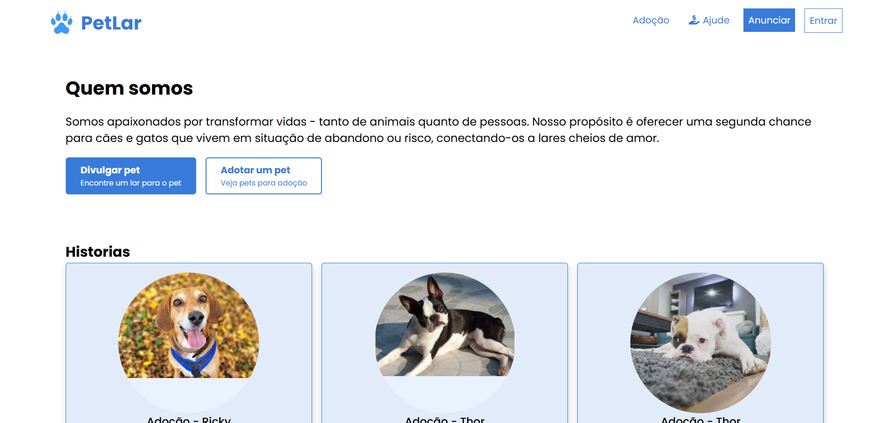
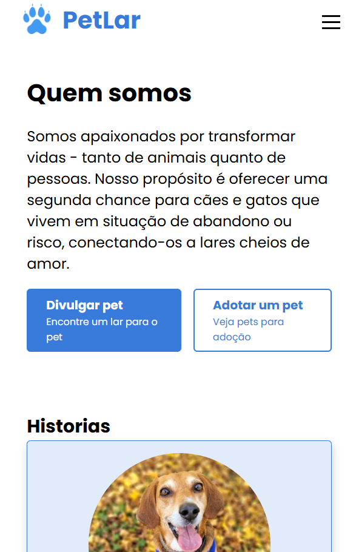

# 🐾 PetLar

Plataforma web voltada para **adoção de animais**, com foco em uma experiência simples, acessível e responsiva.  
O projeto simula um site institucional onde usuários podem conhecer a iniciativa, visualizar animais disponíveis e entrar em contato.

🔗 **Deploy:** https://pet-lar.netlify.app 

---

## ✨ Preview

### 🖥️ Desktop




### 📱 Mobile



> Interface moderna, layout responsivo e foco em usabilidade.

---

## 🚀 Funcionalidades

- ✅ Layout responsivo (mobile-first)
- ✅ Menu acessível com ARIA
- ✅ Seção institucional (“Quem somos”)
- ✅ Cards de animais para adoção
- ✅ Boas práticas de HTML semântico

---

## 🛠️ Tecnologias utilizadas

- **HTML5** — Estrutura semântica
- **CSS3** — Flexbox, Grid, variáveis CSS e animações

---

## ♿ Acessibilidade

O projeto foi desenvolvido com foco em acessibilidade:

- Uso correto de tags semânticas
- Atributos `aria-*` para navegação assistiva
- Estados de foco (`:focus-visible`)
- Navegação funcional via teclado

---

## 📱 Responsividade

Compatível com:

- Smartphones
- Tablets
- Desktops

Layout adaptável sem quebra de conteúdo.

---

## 📂 Estrutura de pastas

```text
📦 petlar
 ┣ 📂 assets
 ┃  ┗ 📂 imagens
 ┃     ┣ 📂 animals
 ┃     ┣  📂 logo
 ┃     ┗📂 screenshot
 ┣ 📂 css
 ┃ ┗ style.css
 ┣ 📜 index.html
 ┣ 📜 login.html
 ┣ 📜 cadastro.html
 ┗ 📜 README.md
