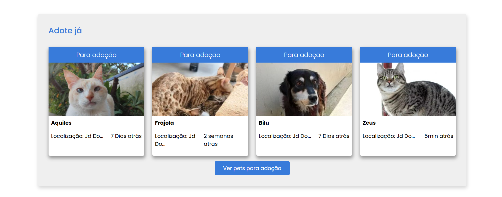
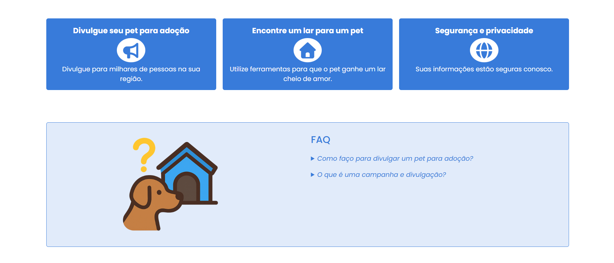

# 🐾 PetLar


# en-US

A web platform focused on animal adoption, designed to deliver a simple, accessible, and responsive user experience.
The project simulates an institutional website where users can learn about the initiative, view animals available for adoption, and get in touch.

🔗 Live Demo: https://pet-lar.netlify.app

## ✨ Preview

### 🖥️ Desktop






### 📱 Mobile


> Modern interface, responsive layout, and a strong focus on usability.

---

## 🚀 Features

- ✅ Responsive layout (mobile-first)
- ✅ Accessible navigation menu with ARIA
- ✅ Institutional section (“About us”)
- ✅ Animal adoption cards
- ✅ Best practices with semantic HTML

---

## 🛠️ Technologies Used

- HTML5 — Semantic structure
- CSS3 — Flexbox, Grid, CSS variables, and animations

---

## ♿ Accessibility

- The project was developed with accessibility in mind:
- Proper use of semantic HTML tags
- aria-* attributes for assistive navigation
- Focus states (:focus-visible)
- Fully functional keyboard navigation

---

## 📱 Responsiveness

Compatible with:

- Smartphones
- Tablets
- Desktops

Adaptive layout without content breaking.

---

## 📂 Folder Structure
```text
📦 petlar
 ┣ 📂 assets
 ┃  ┗ 📂 imagens
 ┃     ┣ 📂 animals
 ┃     ┣  📂 logo
 ┃     ┗📂 screenshot
 ┣ 📂 css
 ┃ ┗ style.css
 ┣ 📜 index.html
 ┣ 📜 login.html
 ┣ 📜 cadastro.html
 ┗ 📜 README.md
```
---
▶️ Running Locally

Clone the repository:

```bash
git clone git@github.com:NatanRBomfim/petlar.git
```

Navigate to the project folder:

```bash
cd pet-lar
```

Open the index.html file in your browser.

---

👨‍💻 Author

Developed by Natan Bomfim

🔗 GitHub: https://github.com/NatanRBomfim

💼 LinkedIn: https://www.linkedin.com/in/natanbomfim/

---

# 🐾 PetLar


# pt-BR

Plataforma web voltada para **adoção de animais**, com foco em uma experiência simples, acessível e responsiva.  
O projeto simula um site institucional onde usuários podem conhecer a iniciativa, visualizar animais disponíveis e entrar em contato.

🔗 **Deploy:** https://pet-lar.netlify.app 

---

## ✨ Preview

### 🖥️ Desktop


### 📱 Mobile


> Interface moderna, layout responsivo e foco em usabilidade.

---

## 🚀 Funcionalidades

- ✅ Layout responsivo (mobile-first)
- ✅ Menu acessível com ARIA
- ✅ Seção institucional (“Quem somos”)
- ✅ Cards de animais para adoção
- ✅ Boas práticas de HTML semântico

---

## 🛠️ Tecnologias utilizadas

- **HTML5** — Estrutura semântica
- **CSS3** — Flexbox, Grid, variáveis CSS e animações

---

## ♿ Acessibilidade

O projeto foi desenvolvido com foco em acessibilidade:

- Uso correto de tags semânticas
- Atributos `aria-*` para navegação assistiva
- Estados de foco (`:focus-visible`)
- Navegação funcional via teclado

---

## 📱 Responsividade

Compatível com:

- Smartphones
- Tablets
- Desktops

Layout adaptável sem quebra de conteúdo.

---

## 📂 Estrutura de pastas

```text
📦 petlar
 ┣ 📂 assets
 ┃  ┗ 📂 imagens
 ┃     ┣ 📂 animals
 ┃     ┣  📂 logo
 ┃     ┗📂 screenshot
 ┣ 📂 css
 ┃ ┗ style.css
 ┣ 📜 index.html
 ┣ 📜 login.html
 ┣ 📜 cadastro.html
 ┗ 📜 README.md
```
---

# Como rodar localmente

Use:

```bash
git clone git@github.com:NatanRBomfim/petlar.git
```

Depois acesse a pasta do projeto:

```bash
cd pet-lar
```
Abra o arquivo index.html no navegador

---

# 👨‍💻 Autor

Desenvolvido por Natan Bomfim

🔗 GitHub: https://github.com/NatanRBomfim

💼 LinkedIn: https://www.linkedin.com/in/natanbomfim/

